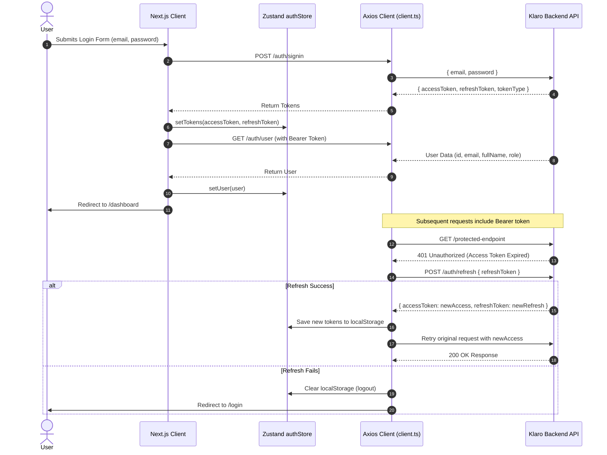

# Klaro Frontend — Comprehensive Architecture & Technical Documentation

> **Application Name:** Klaro (Frontend)  
> **Repository:** `Klaro-Front`  
> **Framework:** Next.js 15 (App Router) + React 18 + TypeScript  
> **Styling:** Tailwind CSS + Custom Dark Theme Design System  
> **State Management:** Zustand  
> **HTTP Client:** Axios (Interceptors with JWT Refresh Flow)  
> **Date:** August 2026  

---

## Table of Contents

1. [Executive Summary](#1-executive-summary)
2. [Technology Stack & Core Dependencies](#2-technology-stack--core-dependencies)
3. [Project Architecture & Directory Structure](#3-project-architecture--directory-structure)
4. [Authentication & Session Flow](#4-authentication--session-flow)
5. [State Management Architecture](#5-state-management-architecture)
6. [API Layer & Backend Integration](#6-api-layer--backend-integration)
7. [Comprehensive Page-by-Page & Feature Breakdown](#7-comprehensive-page-by-page--feature-breakdown)
   - [7.1 Landing Page (`/`)](#71-landing-page-)
   - [7.2 Authentication Pages (`/login`, `/signup`)](#72-authentication-pages-login-signup)
   - [7.3 Dashboard Layout & Shell](#73-dashboard-layout--shell)
   - [7.4 Main Dashboard Overview (`/dashboard`)](#74-main-dashboard-overview-dashboard)
   - [7.5 Group Management (`/groups`, `/groups/[id]`)](#75-group-management-groups-groupsid)
   - [7.6 Projects & Kanban Board (`/projects`, `/projects/[id]`)](#76-projects--kanban-board-projects-projectsid)
   - [7.7 Issues Creation & Details (`/issues/create`, `/issues/[id]`)](#77-issues-creation--details-issuescreate-issuesid)
   - [7.8 Document Hub & RAG AI Chat (`/documents`, `/documents/[id]/chat`)](#78-document-hub--rag-ai-chat-documents-documentsidchat)
   - [7.9 Analytics Dashboard (`/analytics`)](#79-analytics-dashboard-analytics)
   - [7.10 Settings & User Profile (`/settings`)](#710-settings--user-profile-settings)
   - [7.11 Admin Management Panel (`/admin`)](#711-admin-management-panel-admin)
8. [UI Components & Design System](#8-ui-components--design-system)
9. [Configuration & Environment Setup](#9-configuration--environment-setup)
10. [Build, Development & Verification Scripts](#10-build-development--verification-scripts)

---

## 1. Executive Summary

**Klaro** is an AI-powered project management and issue-tracking platform built for collaborative development teams. The frontend delivers a responsive web experience with:
- **Interactive Drag-and-Drop Kanban Boards** for project issue management.
- **RAG (Retrieval-Augmented Generation) AI Chat** for documents and project files.
- **AI Issue Assistant** providing smart recommendations and issue summaries.
- **Role-based Group & Project Collaboration** with invite code systems.
- **Real-time Analytics** and workload visualization charts.
- **Dark Mode UI** using glassmorphism, glowing gradients, and micro-interactions.

---

## 2. Technology Stack & Core Dependencies

| Category | Library / Tool | Version | Description & Purpose |
| :--- | :--- | :--- | :--- |
| **Framework** | `next` | `^15.5.19` | Next.js App Router for client-side routing, server rendering & layout nested trees |
| **Runtime** | `react` / `react-dom` | `^18.2.0` | React component model & reconciliation |
| **Language** | `typescript` | `^5.3.3` | End-to-end type safety across DTOs, API payloads & components |
| **State Store** | `zustand` | `^4.4.7` | Lightweight centralized reactive client stores (`auth`, `sidebar`, `notifications`) |
| **HTTP Client** | `axios` | `^1.6.2` | Network requests with authorization headers, retry interceptors & token refresh |
| **Kanban DnD** | `@dnd-kit/core`, `@dnd-kit/sortable` | `^6.3.1`, `^10.0.0` | Accessible drag-and-drop engine for issue status boards |
| **Charts** | `recharts` | `^2.15.4` | Responsive SVG charts (BarCharts, custom tooltips, grids) |
| **Icons** | `lucide-react`, `react-icons` | `^0.294.0`, `^5.5.0` | Iconography |
| **Animations** | `framer-motion`, `lenis` | `^12.38.0`, `^1.3.17` | Smooth scrolling, page transitions & micro-interactions |
| **Forms & Validation** | `react-hook-form`, `zod` | `^7.49.2`, `^3.22.4` | Form management and schema validation |
| **UI Primitives** | `@radix-ui/*` | Various | Accessible primitives (Dialogs, Dropdowns, Popovers, Tabs, Slots) |
| **Notifications** | `react-hot-toast` | `^2.6.0` | Toast notification system |
| **Styling** | `tailwindcss`, `clsx`, `tailwind-merge` | `^3.4.0` | Utility-first styling with dynamic class composition |

---

## 3. Project Architecture & Directory Structure

```
Klaro-Front/
├── public/                     # Static public assets
├── src/
│   ├── app/                    # Next.js App Router Pages & Layouts
│   │   ├── (auth)/             # Authentication route group (unauthenticated layout)
│   │   │   ├── login/page.tsx  # User Sign-In screen
│   │   │   └── signup/page.tsx # User Registration screen
│   │   ├── (dashboard)/        # Authenticated dashboard route group
│   │   │   ├── admin/          # Admin management view
│   │   │   ├── analytics/      # Performance metrics & charts
│   │   │   ├── dashboard/      # Main overview dashboard
│   │   │   ├── documents/      # Document repository & RAG AI Chat
│   │   │   │   ├── [id]/chat/  # Interactive Document AI Chat workspace
│   │   │   │   └── page.tsx    # Document files grid & upload
│   │   │   ├── groups/         # Team groups & invite system
│   │   │   │   ├── [id]/       # Group detail, owner controls, members & projects
│   │   │   │   └── page.tsx    # Groups list & search
│   │   │   ├── issues/         # Issue tracking
│   │   │   │   ├── [id]/       # Issue detail & comment discussion thread
│   │   │   │   ├── create/     # Issue creation wizard with AI recommendations
│   │   │   │   └── page.tsx    # Issues kanban redirect/page
│   │   │   ├── projects/       # Projects management
│   │   │   │   ├── [id]/       # Project detail with 3-column Kanban board & docs
│   │   │   │   └── page.tsx    # Projects directory
│   │   │   ├── settings/       # User profile and account preferences
│   │   │   ├── dashboard-client-layout.tsx # Dashboard sidebar & navigation shell
│   │   │   └── layout.tsx      # Dashboard root layout wrapper
│   │   ├── globals.css         # Global styles & Tailwind imports
│   │   ├── layout.tsx          # Root HTML / Head layout + Font (Space Grotesk)
│   │   └── page.tsx            # Public landing page with Modern Hero
│   ├── components/             # Reusable UI & Feature components
│   │   ├── auth/               # Auth UI components
│   │   ├── chat/               # MessageContent with markdown & code syntax highlighting
│   │   ├── documents/          # UploadDocumentDialog modal
│   │   ├── groups/             # CreateGroupDialog, JoinGroupDialog, AddMemberDialog
│   │   ├── projects/           # CreateProjectDialog modal
│   │   └── ui/                 # Core design system primitives (Kanban, Bento, Hero, Chart)
│   ├── config/                 # Global configuration & route constants
│   ├── lib/                    # Services, Stores, and Utilities
│   │   ├── api/                # API client & domain service modules
│   │   │   ├── admin.api.ts
│   │   │   ├── ai.api.ts
│   │   │   ├── analytics.api.ts
│   │   │   ├── auth.api.ts
│   │   │   ├── client.ts       # Central Axios instance with JWT interceptors
│   │   │   ├── comments.api.ts
│   │   │   ├── documents.api.ts
│   │   │   ├── groups.api.ts
│   │   │   ├── issues.api.ts
│   │   │   ├── notifications.api.ts
│   │   │   └── projects.api.ts
│   │   ├── stores/             # Zustand Stores
│   │   │   ├── authStore.ts    # User session, JWT tokens, roles
│   │   │   ├── notificationStore.ts
│   │   │   └── sidebarStore.ts # Sidebar collapsible state for full-screen tools
│   │   └── utils.ts            # Classnames merge utility (`cn`)
│   └── types/                  # TypeScript interface declarations
│       ├── analytics.types.ts
│       ├── api.types.ts
│       ├── auth.types.ts
│       ├── comment.types.ts
│       ├── group.types.ts
│       ├── issue.types.ts
│       ├── notification.types.ts
│       ├── project.types.ts
│       └── user.types.ts
├── package.json                # Project dependencies & scripts
├── tailwind.config.ts          # Tailwind styling tokens & theme extensions
└── tsconfig.json               # TypeScript path aliases (`@/*`)
```

---

## 4. Authentication & Session Flow

The frontend implements a JWT authentication flow:



### Key Security & Authorization Features
- **Token Storage:** Tokens are stored in `localStorage` under `accessToken` and `refreshToken`.
- **Automatic Token Refresh:** The Axios response interceptor detects `401 Unauthorized` responses and silently requests a new access token via `POST /auth/refresh`, then retries the original failed request without interrupting the user.
- **Client Route Protection:** The `DashboardClientLayout` checks for the token on mount; if absent or invalid, it redirects the browser to `/login`.
- **Role Verification:** `authStore.isAdmin()` validates if the user holds `ROLE_ADMIN` permissions for administrative views (`/admin`).
- **Group Owner Guards:** Actions such as group deletion, invite code regeneration, and member removal are guarded on the client by checking `group.ownerEmail === currentUserEmail`.

---

## 5. State Management Architecture

Centralized state is handled via **Zustand** stores in `src/lib/stores/`:

### 1. `authStore.ts`
Manages the user identity and authentication status:
- `user: User | null` — Current logged-in user profile (`id`, `email`, `fullName`, `role`).
- `accessToken: string | null`, `refreshToken: string | null`.
- `isAuthenticated: boolean` — True when active session exists.
- `setTokens(accessToken, refreshToken)` — Stores tokens and marks authenticated.
- `setUser(user)` — Updates the current user state.
- `fetchCurrentUser()` — Fetches current user profile from `/auth/user`.
- `isAdmin()` — Helper returning `true` if `user.role === 'ROLE_ADMIN'`.
- `logout()` — Clears stored tokens and resets state to logged out.

### 2. `sidebarStore.ts`
Provides controls for workspace layout expansion:
- `isCollapsed: boolean` — Indicates if the main dashboard sidebar is collapsed.
- `toggleSidebar()` — Toggles sidebar visibility (used in Document Chat).
- `expandSidebar()` / `collapseSidebar()` — Explicit controls.

### 3. `notificationStore.ts`
Handles in-app notification alerts and counts:
- `notifications: Notification[]`, `unreadCount: number`.
- `addNotification()`, `markAsRead()`, `clearAll()`.

---

## 6. API Layer & Backend Integration

All external API interactions go through domain-specific service files in `src/lib/api/`:

| API Service Module | Endpoints Covered | Functionality |
| :--- | :--- | :--- |
| **`authApi`** | `POST /auth/signup`<br>`POST /auth/signin`<br>`POST /auth/refresh`<br>`GET /auth/user`<br>`POST /auth/logout` | User registration, login, token refresh, current user retrieval, logout |
| **`groupsApi`** | `POST /groups`<br>`GET /groups`<br>`GET /groups/all`<br>`GET /groups/{id}`<br>`GET /groups/search`<br>`POST /groups/{id}/members`<br>`DELETE /groups/{id}/members`<br>`DELETE /groups/{id}`<br>`GET /groups/{id}/invite-code`<br>`POST /groups/{id}/regenerate-invite-code`<br>`POST /groups/join-by-code` | Group CRUD, search, invite code generation/regeneration, joining by code, adding/removing members |
| **`projectsApi`** | `POST /projects`<br>`GET /projects`<br>`GET /projects/all`<br>`GET /projects/groups/{groupId}/projects`<br>`GET /projects/{id}`<br>`PUT /projects/{id}`<br>`DELETE /projects/{id}` | Project creation, retrieval by user/group, project updates, project deletion |
| **`issuesApi`** | `POST /api/issues`<br>`GET /api/issues/projects/{projectId}/issues`<br>`GET /api/issues/{id}`<br>`PATCH /api/issues/{id}/status`<br>`DELETE /api/issues/{id}`<br>`GET /api/issues/issues/assigned-to/me` | Issue CRUD, status transitions, assigned issues querying |
| **`documentsApi`** | `POST /api/documents/upload`<br>`GET /api/documents/project/{projectId}`<br>`GET /api/documents`<br>`GET /api/documents/{id}`<br>`GET /api/documents/{id}/download`<br>`DELETE /api/documents/{id}`<br>`POST /api/documents/{id}/chat`<br>`GET /api/documents/{id}/chat` | PDF upload, project document retrieval, download blobs, RAG AI chat queries, collaborative chat history |
| **`commentsApi`** | `GET /api/comments/issue/{issueId}`<br>`POST /api/comments/issue/{issueId}`<br>`DELETE /api/comments/{id}` | Issue discussion threads and comment submissions |
| **`aiApi`** | `POST /api/ai/generate` | Generates AI recommendations and summaries for issue descriptions |
| **`analyticsApi`** | `GET /analytics/dashboard`<br>`GET /analytics/projects/{id}` | Dashboard metrics and project performance aggregations |
| **`adminApi`** | `GET /admin/users`<br>`PUT /admin/users/{id}/role`<br>`DELETE /admin/users/{id}` | Administrative user management and role assignment |

---

## 7. Comprehensive Page-by-Page & Feature Breakdown

### 7.1 Landing Page (`/`)
- **File:** `src/app/page.tsx` & `src/components/ui/hero-section.tsx`
- **Features:**
  - Modern hero section with animated gradients and typography.
  - Quick action links directing users to **Sign In** or **Get Started (Sign Up)**.
  - Interactive feature highlights explaining Kanban workflows, RAG AI Document Chat, and Team Collaboration.

---

### 7.2 Authentication Pages (`/login`, `/signup`)

#### **Login Page (`/login`)**
- **File:** `src/app/(auth)/login/page.tsx`
- **Functionality:**
  - Form fields: `email`, `password`.
  - Password visibility toggle (Eye/EyeOff icon).
  - Handles authentication via `authApi.login()`.
  - Automatically fetches user profile (`authApi.getCurrentUser()`) and persists user + tokens to `authStore`.
  - Displays hot toast welcome notification and routes to `/dashboard`.

#### **Signup Page (`/signup`)**
- **File:** `src/app/(auth)/signup/page.tsx`
- **Functionality:**
  - Form fields: `fullName`, `email`, `password`, `confirmPassword`.
  - Client-side validation: Matching passwords check, minimum 6 characters length.
  - Role payload omitted (backend defaults automatically to `ROLE_USER`).
  - Calls `authApi.signup()`, informs user of success, and redirects to `/login`.

---

### 7.3 Dashboard Layout & Shell
- **File:** `src/app/(dashboard)/dashboard-client-layout.tsx`
- **Functionality:**
  - **Navigation Sidebar:**
    - Collapsible sidebar with active route highlighting (`Home`, `Groups`, `Projects`, `Analytics`, `Settings`).
    - Quick search bar filter (`/` hotkey shortcut indicator).
    - Mobile-friendly sliding drawer with backdrop overlay.
  - **Top Header Bar:**
    - Mobile menu trigger button.
    - User avatar initial bubble, full name, and email address.
    - Global **Logout** button.
  - **Auth Guard:** Hydrates user state on reload; redirects unauthenticated visitors to `/login`.

---

### 7.4 Main Dashboard Overview (`/dashboard`)
- **File:** `src/app/(dashboard)/dashboard/page.tsx`
- **Functionality:**
  - **Metrics Overview:**
    - Real-time counts: **Total Projects**, **Total Issues**, **Total Groups**.
    - Trend indicators with percentage metrics.
  - **Interactive Activity Chart:**
    - Monthly Issues Created Bar Chart built with **Recharts**.
    - Hoverable tooltips displaying monthly counts.
  - **Quick Metric Cards:**
    - Direct link cards for Projects, Open Issues, In-Progress Issues, and Groups.
  - **Recent Issues Feed:**
    - Displays the 5 most recently created issues across projects.
    - Status pills (`OPEN`, `IN_PROGRESS`, `RESOLVED`) and priority tags (`HIGH`, `MEDIUM`, `LOW`).

---

### 7.5 Group Management (`/groups`, `/groups/[id]`)

#### **Groups Directory (`/groups`)**
- **File:** `src/app/(dashboard)/groups/page.tsx`
- **Functionality:**
  - Loads all groups the current user belongs to via `groupsApi.getUserGroups()`.
  - Real-time search bar filtering groups by name or description.
  - **"Create Group" Button:** Accessible to all logged-in users; opens `CreateGroupDialog`.
  - **"Join Group" Button:** Opens `JoinGroupDialog` allowing users to join via an alphanumeric invite code.
  - Group card displays member count and project count with direct link to details.

#### **Group Detail View (`/groups/[id]`)**
- **File:** `src/app/(dashboard)/groups/[id]/page.tsx`
- **Functionality:**
  - **Header & Statistics:** Displays group title, description, member count, project count, creation date.
  - **Owner Controls (`isOwner`):**
    - **Delete Group:** Permanently deletes the group with confirmation dialog.
    - **Invite Code Box:** Displays the 12-character unique code, copy-to-clipboard button, and **Regenerate Code** action.
  - **Member Management:**
    - Member list displaying avatars, names, emails, and **Owner Crown** badge.
    - **"Add Member" Button:** Opens `AddMemberDialog` to invite team members directly by email.
    - **"Remove Member" Action:** Owner can remove any non-owner member.
  - **Group Projects Section:**
    - Lists projects inside this group.
    - **"Create Project" Button:** Opens `CreateProjectDialog` pre-filled with the active group ID.
    - Owner/Admin can delete projects directly from this view.

---

### 7.6 Projects & Kanban Board (`/projects`, `/projects/[id]`)

#### **Projects Directory (`/projects`)**
- **File:** `src/app/(dashboard)/projects/page.tsx`
- **Functionality:**
  - Aggregates all projects the user is involved in.
  - Search filter by project name and description.
  - Links to group creation when no projects exist.

#### **Project Detail & Interactive Kanban Board (`/projects/[id]`)**
- **File:** `src/app/(dashboard)/projects/[id]/page.tsx`
- **Functionality:**
  - **Project Header:** Author info, associated group name, created timestamp, issue count.
  - **Drag-and-Drop Kanban Board:**
    - Powered by `@dnd-kit/core` and `@dnd-kit/sortable`.
    - Three columns: **📝 To Do (`TO_DO` / `OPEN`)**, **⚡ In Progress (`IN_PROGRESS`)**, **✅ Done (`DONE` / `RESOLVED` / `CLOSED`)**.
    - Dragging an issue card between columns triggers optimistic UI state updates and sends a `PATCH /api/issues/{id}/status` request.
    - Issue cards show issue title, type icon (`🐛 BUG`, `✨ FEATURE`, `📋 TASK`), priority badge, assignee, description snippet, and delete button.
  - **Project Documents Section:**
    - Uploaded PDF documents attached to this project.
    - Direct **Download**, **Chat with AI**, and **Delete** actions.
    - **"Upload Document" Button:** Opens `UploadDocumentDialog`.

---

### 7.7 Issues Creation & Details (`/issues/create`, `/issues/[id]`)

#### **Create Issue Wizard (`/issues/create`)**
- **File:** `src/app/(dashboard)/issues/create/page.tsx`
- **Functionality:**
  - Project selector dropdown (auto-selected if `?projectId=` query parameter is present).
  - Issue type selector with visual icons (`BUG`, `FEATURE`, `TASK`).
  - Issue title & description inputs.
  - **AI Recommendation Engine:** Clicking **"Get AI Recommendation"** calls `aiApi.generateContent()` with the issue description, generating intelligent suggestions and debugging steps.
  - Priority selector (`LOW`, `MEDIUM`, `HIGH`).
  - Initial status selector (`TO_DO`, `IN_PROGRESS`, `DONE`).
  - Optional Assignee ID assignment.
  - Form submission redirects user directly back to the project Kanban board.

#### **Issue Detail & Comments Discussion (`/issues/[id]`)**
- **File:** `src/app/(dashboard)/issues/[id]/page.tsx`
- **Functionality:**
  - Header with issue type, priority pill, status tag, title, and detailed description.
  - Metadata cards: Creator, Assignee, Creation date.
  - **Comments System:**
    - Fetches discussion comments via `commentsApi.getCommentsByIssue(issueId)`.
    - Comment submission form with textarea and loading states.
    - Comment list showing author initials avatar, author name, timestamp, and formatted comment text.

---

### 7.8 Document Hub & RAG AI Chat (`/documents`, `/documents/[id]/chat`)

#### **Documents Directory (`/documents`)**
- **File:** `src/app/(dashboard)/documents/page.tsx`
- **Functionality:**
  - Lists all uploaded PDF files across projects.
  - Real-time search filter by filename or summary keywords.
  - File cards showing file size (KB), upload date, page count, and AI-generated summary.
  - Actions: Delete document, or click **"Chat with AI"** to open workspace.

#### **Document RAG AI Chat Workspace (`/documents/[id]/chat`)**
- **File:** `src/app/(dashboard)/documents/[id]/chat/page.tsx`
- **Functionality:**
  - **Full-Screen Workspace Layout:** Automatically integrates with `sidebarStore` to maximize horizontal chat area.
  - **Left Document Switcher:** Browse and switch between documents in the project; download or delete files directly.
  - **Dual Collaborative & AI Chat:**
    - **Team Discussion:** Regular chat messages sent to team members.
    - **RAG AI Assistant:** Typing `AI ` in the input box or toggling AI mode sends prompts to the document's RAG pipeline.
    - RAG responses are streamed with an **AI Assistant badge** and animated thinking indicators.
  - **Rich Markdown Message Rendering:** `MessageContent.tsx` parses markdown, bullet points, headers, inline code, and syntax-highlighted code blocks with a one-click **Copy Code** button.
  - **Auto-polling:** Automatically polls chat history every 3 seconds to keep conversations in sync across multiple team members.

---

### 7.9 Analytics Dashboard (`/analytics`)
- **File:** `src/app/(dashboard)/analytics/page.tsx`
- **Functionality:**
  - Aggregates issues and metrics across all projects the user belongs to.
  - **Top KPI Cards:** Total Projects, Total Issues, Completion Rate percentage with progress bar, High Priority Issue warnings.
  - **Visual Distribution Breakdown:**
    - Issues by Status: Progress bars for To Do, In Progress, Done.
    - Issues by Priority: Percentage distribution for High, Medium, Low.
    - Issues by Type: Bugs, Features, Tasks.
  - **Project Performance Table:** Table showing per-project issue breakdown (Total, Done, In Progress, To Do) with color-coded completion percentage bars.

---

### 7.10 Settings & User Profile (`/settings`)
- **File:** `src/app/(dashboard)/settings/page.tsx`
- **Functionality:**
  - Displays user profile information (Full Name, registered email address).
  - System role badge indicator (`Admin` vs `User`).
  - Profile update form with saving animation and feedback notifications.

---

### 7.11 Admin Management Panel (`/admin`)
- **File:** `src/app/(dashboard)/admin/page.tsx`
- **Functionality:**
  - Route protected by `isAdmin()` check; non-admin users are automatically redirected to `/dashboard`.
  - System activity metrics: Total Users, Active Users, Admins Count, Daily Activity.
  - User management table with search filter, role badges, status indicators, and administrative actions.

---

## 8. UI Components & Design System

### 1. Theme & Color Tokens
- **Background Root:** `#0d0d0f` (Deep OLED black)
- **Card / Surface:** `#131316`
- **Secondary Surface:** `#1a1a1d`
- **Borders & Dividers:** `#1f1f23` (Subtle dark border) / Hover: `#2a2a2e`
- **Primary Brand Accent:** Blue (`#3b82f6` / `from-blue-500 to-cyan-400`)
- **Typography:** `Space Grotesk` (Google Font)

### 2. Dialogs & Modals
- `CreateGroupDialog.tsx`: Modal for creating groups with name & description; shows generated invite code on creation.
- `JoinGroupDialog.tsx`: Modal for joining a group via invite code.
- `AddMemberDialog.tsx`: Modal for group owners to add members by email.
- `CreateProjectDialog.tsx`: Modal for creating projects inside a group.
- `UploadDocumentDialog.tsx`: Drag-and-drop file upload dialog supporting PDF files.

### 3. Visual Components
- `kanban.tsx`: Compound components (`Kanban`, `KanbanBoard`, `KanbanColumn`, `KanbanItem`, `KanbanOverlay`) for drag-and-drop boards.
- `chart.tsx`: Tooltip and container abstractions for Recharts visualizations.
- `MessageContent.tsx`: Markdown parser and syntax highlighter for Document Chat.
- `features-bento.tsx` & `modern-hero.tsx`: Bento grid and hero components for the landing page.

---

## 9. Configuration & Environment Setup

Create or update `.env.local` in the project root:

```env
# URL pointing to the Klaro Spring Boot Backend API
NEXT_PUBLIC_API_BASE_URL=http://localhost:8080
```

### Key Constants (`src/config/constants.ts`)
- Storage keys:
  - `ACCESS_TOKEN`: `'accessToken'`
  - `REFRESH_TOKEN`: `'refreshToken'`
- Route paths:
  - `LOGIN`: `'/login'`
  - `SIGNUP`: `'/signup'`
  - `DASHBOARD`: `'/dashboard'`
  - `GROUPS`: `'/groups'`
  - `PROJECTS`: `'/projects'`
  - `DOCUMENTS`: `'/documents'`

---

## 10. Build, Development & Verification Scripts

In `package.json`:

```json
"scripts": {
  "dev": "node --no-experimental-webstorage ./node_modules/.bin/next dev",
  "build": "node --no-experimental-webstorage ./node_modules/.bin/next build",
  "start": "node --no-experimental-webstorage ./node_modules/.bin/next start",
  "lint": "next lint",
  "type-check": "tsc --noEmit"
}
```

### Running Locally
```bash
# 1. Install dependencies
npm install

# 2. Run TypeScript type check
npm run type-check

# 3. Start local development server
npm run dev
# Server will start on http://localhost:3000 (or http://localhost:3001 if port 3000 is occupied)
```

---

*Documentation compiled and verified for Klaro-Front.*
